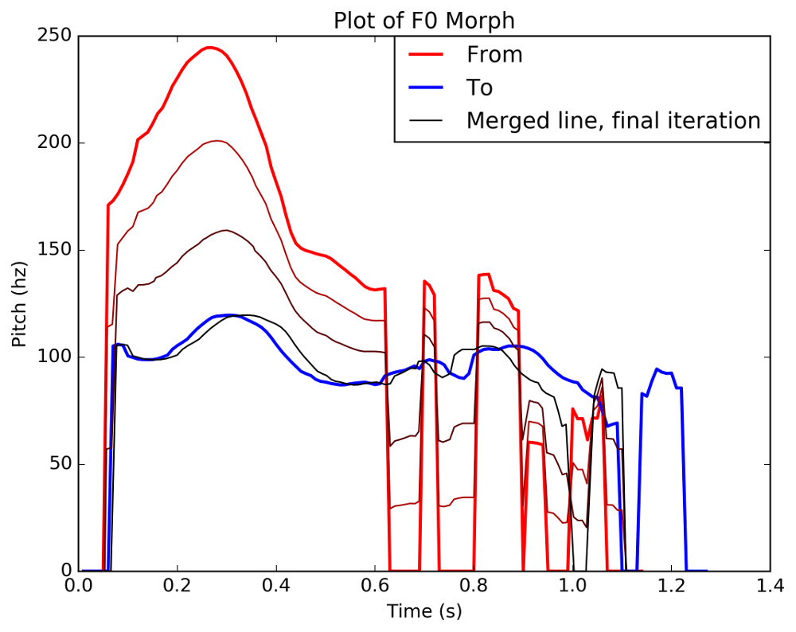
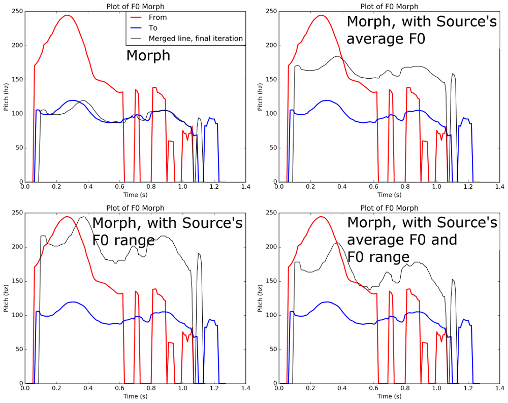
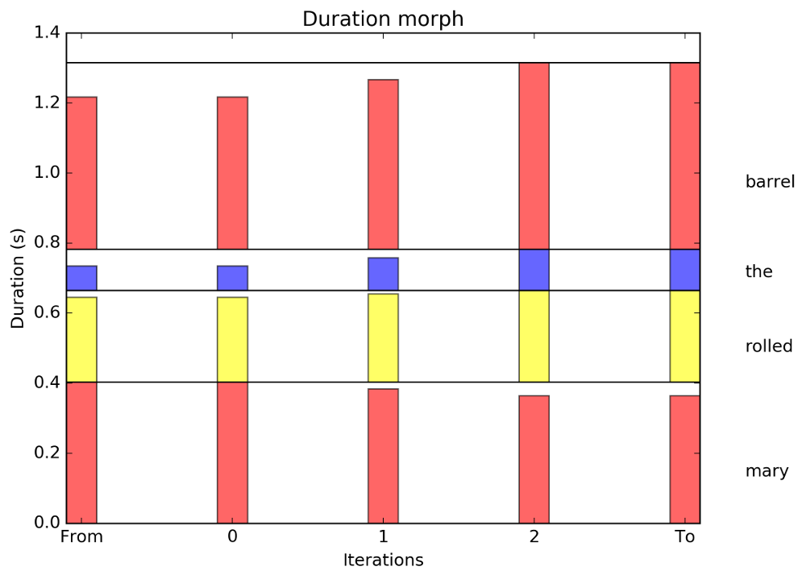

-----------------------
ProMo (Prosody Morph)
-----------------------

.. image:: https://travis-ci.org/timmahrt/ProMo.svg?branch=master
    :target: https://travis-ci.org/timmahrt/ProMo

.. image:: https://coveralls.io/repos/github/timmahrt/ProMo/badge.svg?branch=master
    :target: https://coveralls.io/github/timmahrt/ProMo?branch=master
    
.. image:: https://img.shields.io/badge/license-MIT-blue.svg?
   :target: http://opensource.org/licenses/MIT
   
*Questions?  Comments?  Feedback?  Chat with us on gitter!*

.. image:: https://badges.gitter.im/pythonProMo/Lobby.svg?
   :alt: Join the chat at https://gitter.im/pythonProMo/Lobby
   :target: https://gitter.im/pythonProMo/Lobby?utm_source=badge&utm_medium=badge&utm_campaign=pr-badge&utm_content=badge

-----

A library for manipulating pitch and duration in an algorithmic way, for
resynthesizing speech.

This library can be used to resynthesize pitch in natural speech using pitch
contours taken from other speech samples, generated pitch contours,
or through algorithmic manipulations of the source pitch contour.

.. sectnum::
.. contents::

Common Use Cases
================

What can you do with this library?

Apply the pitch or duration from one speech sample to another.

- alignment happens both in time and in hertz

    - after the morph process, the source pitch points will be at the same
      absolute pitch and relative time as they are in the target file 
      
    - time is relative to the start and stop time of the interval being
      considered (e.g. the pitch value at 80% of the duration of the interval).
      Relative time is used so that the source and target files don't have to
      be the same length.

    - temporal morphing is a minor effect if the sampling frequency is high
      but it can be significant when, for example, using a stylized pitch
      contour with few pitch samples.

- modifications can be done between entire wav files or between
  corresponding intervals as specified in a textgrid or other annotation
  (indicating the boundaries of words, stressed vowels, etc.)

    - the larger the file, the less useful the results are likely to be
      without using a transcript of some sort
      
    - the transcripts do not have to match in lexical content, only in the
      number of intervals  (same number of words or phones, etc.)

- modifications can be scaled (it is possible to generate a wav file with
  a pitch contour that is 30% or 60% between the source and target contours).

- can also morph the pitch range and average pitch independently.
  
- resynthesis is performed by Praat.

- pitch can be obtained from praat (such as by using praatio)
  or from other sources (e.g. ESPS getF0)

- plots of the resynthesis (such as the ones below) can be generated

Illustrative example
======================

Consider the phrase "Mary rolled the barrel".  In the first recording
(examples/mary1.wav), "Mary rolled the barrel" was said in response
to a question such as "Did John roll the barrel?".  On the other hand,
in the second recording (examples/mary2.wav) the utterance was said 
in response to a question such as "What happened yesterday".

"Mary" in "mary1.wav" is produced with more emphasis than in "mary2.wav".
It is longer and carries a more drammatic pitch excursion.  Using 
ProMo, we can make mary1.wav spoken similar to mary2.wav, even
though they were spoken in a different way and by different speakers.

Duration and pitch carry meaning.  Change these, and you can change the
meaning being conveyed.

``Note that modifying pitch and duration too much can introduce artifacts. 
Such artifacts can be heard even in pitch morphing mary1.wav to mary2.wav.``

Pitch morphing (examples/pitch_morph_example.py):

    The following image shows morphing of pitch from mary1.wav to mary2.wav
    on a word-by-word level
    in increments of 33% (33%, 66%, 100%).  Note that the morph adjusts the
    temporal dimension of the target signal to fit the duration of the source
    signal (the source and generated contours are equally shorter 
    than the target contour).  This occurs at the level of the file unless
    the user specifies an equal number of segments to align in time
    (e.g. using word-level transcriptions, as done here, or phone-level
    transcriptions, etc.)

With the ability to morph pitch range and average pitch, it becomes easier
to morph contours produced by different speakers:

    The following image shows four different pitch manipulations.  On the 
    **upper left** is the raw morph.  Notice that final output (black line) is
    very close to the target.  Differences stem from duration differences.
    
    However, the average pitch and pitch range are qualities of speech that
    can signify differences in gender in addition to other aspects of
    speaker identity.  By resetting the average pitch and pitch range to
    that of the source, it is possible to morph the contour while maintaining
    aspects of the source speaker's identity.
    
    The image in the **upper right** contains a morph
    followed by a reset of the average pitch to the source speaker's average
    pitch.  In the **bottom right** a morph followed by a reset of the speaker's
    pitch range.  In the **bottom right** pitch range was reset and then the
    speaker's average pitch was reset.
    
    The longer the speech sample, the more representative the pitch range and
    mean pitch will be of the speaker.  In this example both are skewed higher
    by the pitch accent on the first word.

    Here the average pitch of the source (a female speaker) is much higher
    than the target (a male speaker) and the resulting morph sounds like it
    comes from a different speaker than the source or target speakers.
    The three recordings that involve resetting pitch range and/or average
    pitch sound much more natural.

   
Duration morphing (examples/duration_manipulation_example.py):

    The following image shows morphing of duration from mary1.wav to mary2.wav
    on a word-by-word basis in increments of 33% (33%, 66%, 100%).
    This process can operate over an entire file or, similar to pitch morphing,
    with annotated segments, as done in this example.

Tutorials
================

Tutorials for learning about prosody manipulation and how to use ProMo are available.

`Tutorial 1.1: Intro to ProMo <https://nbviewer.jupyter.org/github/timmahrt/ProMo/blob/master/tutorials/tutorial1_1_intro_to_promo.ipynb>`_

`Tutorial 1.2: Pitch manipulation tutorial <https://nbviewer.jupyter.org/github/timmahrt/ProMo/blob/master/tutorials/tutorial1_2_pitch_manipulations.ipynb>`_

Major revisions
================

Ver 1.3 (May 29, 2017)

- added tutorials

- f0Morph() can now exclude certain regions from the morph process if desired

Ver 1.2 (January 27, 2017)

- added code for reshaping pitch accents (shift alignment, add plateau, or change height)

Ver 1.1 (February 22, 2016)

- f0 morph code for modifying speaker pitch range and average pitch

- (October 20, 2016) Added integration tests with travis CI and coveralls support.

Ver 1.0 (January 19, 2016)

- first public release.

Beta (July 1, 2013)

- first version which was utilized in my dissertation work

Requirements
==============

``Python 2.7.*`` or above

``Python 3.3.*`` or above (or below, probably)

My praatIO library is used extensively and can be downloaded 
`here <https://github.com/timmahrt/praatIO>`_

Matplotlib is needed if you want to plot graphs.
`Matplotlib website <http://matplotlib.org/>`_

Scipy is needed if you want to use interpolation--typically if you have stylized
pitch contours (in praat PitchTier format, for example) that you want to use in
your morphing).
`Scipy website <http://scipy.org/>`_

Matplotlib and SciPy are non-trivial to install, as they depends on several large
packages.  You can
visit their websites for more information.  **I recommend the following instructions to
install matplotlib** which uses *python wheels*.  These will install all required
libraries in one fell swoop.

On Mac, open a terminal and type:

    python -m pip install matplotlib
    
    python -m pip install scipy
    
On Windows, open a cmd or powershell window and type:

    <<path to python>> -m pip install matplotlib
    
    <<path to python>> -m pip install scipy
    
    e.g. C:\\python27\\python.exe -m install matplotlib

Otherwise, to manually install, after downloading the source from github, from a command-line shell, navigate to the directory containing setup.py and type::

    python setup.py install

If python is not in your path, you'll need to enter the full path e.g.::

	C:\Python27\python.exe setup.py install

Usage
=========

See /examples for example usages

Installation
================

If you on Windows, you can use the installer found here (check that it is up to date though)
`Windows installer <http://www.timmahrt.com/python_installers>`_

Promo is on pypi and can be installed or upgraded from the command-line shell with pip like so::

    python -m pip install promo --upgrade

Otherwise, to manually install, after downloading the source from github, from a command-line shell, navigate to the directory containing setup.py and type::

    python setup.py install

If python is not in your path, you'll need to enter the full path e.g.::

    C:\Python36\python.exe setup.py install

Citing ProMo
===============

If you use ProMo in your research, please cite it like so:

Tim Mahrt. ProMo: The Prosody-Morphing Library.
https://github.com/timmahrt/ProMo, 2016.

Acknowledgements
================

Development of ProMo was possible thanks to NSF grant **BCS 12-51343** to
Jennifer Cole, José I. Hualde, and Caroline Smith and to the A*MIDEX project
(n° **ANR-11-IDEX-0001-02**) to James Sneed German funded by the
Investissements d'Avenir French Government program,
managed by the French National Research Agency (ANR).
